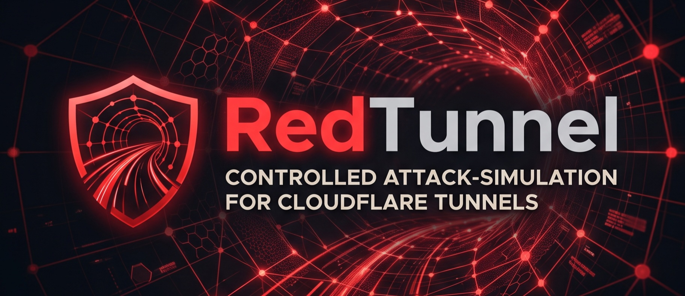

# **RedTunnel**

**RedTunnel is a controlled attack‑simulation tool for Cloudflare Tunnels, designed to verify domain ownership and safely emulate hostile traffic without violating network or provider policies.**

---

## ✨ Features

### Cross-Platform Support
- **Multi-Platform**: Runs on Linux, macOS, Windows, and Android (via Termux)
- **Automatic Detection**: Platform-specific optimizations and capability detection
- **Termux Support**: Fully optimized for mobile environments with resource-aware settings
- **Terminal Capability Detection**: Automatic detection of color, Unicode, and NerdFont support

### Interactive TUI
- **Modern Text-Based Interface**: Clean, intuitive navigation with keyboard controls
- **NerdFont Integration**: Enhanced icons with automatic ASCII fallback for unsupported terminals
- **Theme System**: Multiple built-in themes (default, dark, light, minimal)
- **Responsive Components**: Progress bars, spinners, menus, tables, and dialogs

### Multi-Environment Configuration
- **Environment Management**: Development, staging, production, and testing environments
- **Flexible Configuration**: File-based, environment variable, and CLI-based configuration
- **Environment-Specific Settings**: Separate configs for each environment
- **Secure Defaults**: Sensible defaults with security-first approach

### Cloudflare Integration
- **API Verification**: Validate Cloudflare credentials and permissions
- **Zone Access Verification**: Confirm tunnel and domain ownership
- **Account Access Checks**: Ensure proper API token permissions
- **Safe Simulation Framework**: Foundation for compliant traffic simulation

### Developer Experience
- **Clean Architecture**: Modular, maintainable codebase
- **Comprehensive Documentation**: Installation, architecture, and usage guides
- **Type Safety**: Type hints throughout the codebase
- **Testing Ready**: Pytest integration with coverage support

---

## 🚀 Quick Start

### Installation

```bash
# Clone the repository
git clone https://github.com/developer51709/RedTunnel.git
cd RedTunnel

# Install dependencies
pip install -r requirements.txt

# Run the application
python src/main.py
```

### Platform-Specific Installation

#### Linux/macOS
```bash
pip install -r requirements.txt
python src/main.py
```

#### Windows
```cmd
pip install -r requirements.txt
python src/main.py
```

#### Android (Termux)
```bash
pkg update && pkg upgrade
pkg install python git
git clone https://github.com/developer51709/RedTunnel.git
cd RedTunnel
pip install -r requirements.txt
python src/main.py
```

---

## 📖 Usage

### Command-Line Options

```bash
# Run the interactive TUI
python src/main.py

# Check platform information
python src/main.py --platform-info

# Set environment
python src/main.py --environment production

# Use custom configuration
python src/main.py --config /path/to/config.yml

# Show version
python src/main.py --version
```

### Interactive TUI Navigation

- **↑/K** - Move up in menus
- **↓/J** - Move down in menus  
- **Enter** - Select menu item
- **Q** - Quit application

### Configuration

Create your configuration file from the example:

```bash
cp config/settings.example.yml config/settings.yml
```

Edit `config/settings.yml` with your Cloudflare credentials:

```yaml
cloudflare:
  api_token: "your-api-token"
  account_id: "your-account-id"
  zone_id: "your-zone-id"
```

Or use environment variables:

```bash
export REDTUNNEL_CF_API_TOKEN="your-api-token"
export REDTUNNEL_CF_ACCOUNT_ID="your-account-id"
export REDTUNNEL_CF_ZONE_ID="your-zone-id"
```

---

## 🏗️ Architecture

RedTunnel is built with a modular, cross-platform architecture:

```
RedTunnel/
├── src/
│   ├── core/              # Platform detection & environment management
│   ├── tui/               # Interactive TUI framework
│   ├── cloudflare/        # Cloudflare API integration
│   ├── utils/             # Utility functions
│   └── main.py            # Main entry point
├── config/
│   ├── settings.yml       # Main configuration
│   └── environments/      # Environment-specific configs
├── docs/                  # Comprehensive documentation
└── tests/                 # Test suite
```

### Core Components

- **Platform Detection**: Automatic detection of OS, terminal capabilities, and mobile environments
- **Environment Management**: Multi-environment support with hierarchical configuration
- **TUI Framework**: Custom text-based UI with NerdFont support and fallback
- **Icon System**: NerdFont icons with automatic ASCII fallback
- **Theme Engine**: Multiple color themes with automatic capability detection

---

## 📚 Documentation

- [Installation Guide](docs/INSTALLATION.md) - Detailed installation instructions for all platforms
- [Architecture Documentation](docs/ARCHITECTURE.md) - Technical architecture and design patterns
- [Usage Guide](docs/USAGE.md) - Comprehensive usage instructions and examples
- [Agent Guide](AGENTS.md) - Development guide for contributors

---

## 🛠️ Development

### Development Setup

```bash
# Clone the repository
git clone https://github.com/developer51709/RedTunnel.git
cd RedTunnel

# Install development dependencies
pip install -e ".[dev]"

# Run tests
pytest

# Run with coverage
pytest --cov=src
```

### Code Quality

```bash
# Format code
black src/

# Lint code
flake8 src/

# Type check
mypy src/
```

---

## 🚧 Current Status

### Completed Features ✅
- Cross-platform support (Linux, macOS, Windows, Android/Termux)
- Platform detection and capability assessment
- Multi-environment configuration management
- Interactive TUI framework
- NerdFont support with ASCII fallback
- Theme system with multiple themes
- Cloudflare API verification
- Comprehensive documentation

### In Development 🚧
- Traffic simulation engine
- Attack pattern generation
- Report generation and analysis
- Advanced tunnel diagnostics
- Real-time monitoring

### Planned Features 📋
- Web-based dashboard
- API for automation
- Advanced simulation scenarios
- Integration with other security tools
- Export and import functionality

---

## 🤝 Contributing

RedTunnel is an open‑source project, and community involvement is encouraged.  
If you’d like to contribute:

- Submit pull requests
- Open issues
- Propose features
- Improve documentation
- Review code
- Test on different platforms

All contributions that align with the project’s mission of **safe, authorized, Cloudflare‑compliant attack simulation** are welcome.

See [CONTRIBUTING.md](CONTRIBUTING.md) for detailed guidelines.

---

## 💖 Support Development

If you want to help accelerate development, you can support the project through donations.  
Contributions help fund:

- Additional testing environments
- Cloudflare‑specific research
- Tooling and infrastructure
- Long‑term maintenance

Your support directly helps RedTunnel grow into a robust, reliable, and widely trusted attack‑simulation framework.

---

## 🔐 Project Goals

RedTunnel is built around four core principles:

- **Safety** — No illegal traffic patterns, no spoofing, no volumetric attacks
- **Verification** — Domain and tunnel ownership must be confirmed before any simulation
- **Compliance** — Fully aligned with Cloudflare’s acceptable‑use policies
- **Transparency** — Clear documentation, open development, and community involvement

---

## 📜 License

This project is licensed under the **Apache 2.0 License**

---

## 🔗 Links

- **Repository**: https://github.com/developer51709/RedTunnel
- **Issues**: https://github.com/developer51709/RedTunnel/issues
- **Documentation**: https://github.com/developer51709/RedTunnel/tree/main/docs
- **License**: https://github.com/developer51709/RedTunnel/blob/main/LICENSE

---

## ⚡ Requirements

- Python 3.8 or higher
- pip (Python package manager)
- Git (for cloning the repository)

### Python Dependencies

- requests
- pyyaml
- rich
- nerdfont
- textual
- pytest (for development)

---

## 🎯 Platform Support Matrix

| Platform | Status | Notes |
|----------|--------|-------|
| Linux | ✅ Fully Supported | All features available |
| macOS | ✅ Fully Supported | All features available |
| Windows | ✅ Fully Supported | All features available |
| Android (Termux) | ✅ Fully Supported | Optimized for mobile, auto-detected |

---

## 📞 Support

For support, questions, or discussions:
- Open an issue on GitHub
- Check the [documentation](docs/)
- Review existing [issues](https://github.com/developer51709/RedTunnel/issues)

---

**Made with ❤️ for the security community**
